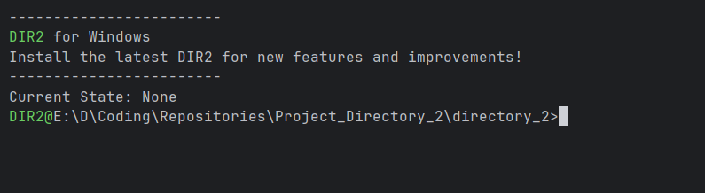
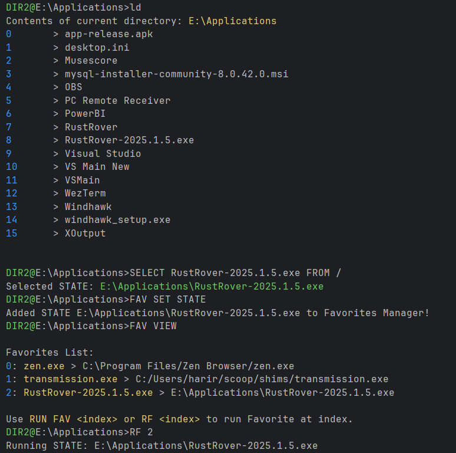
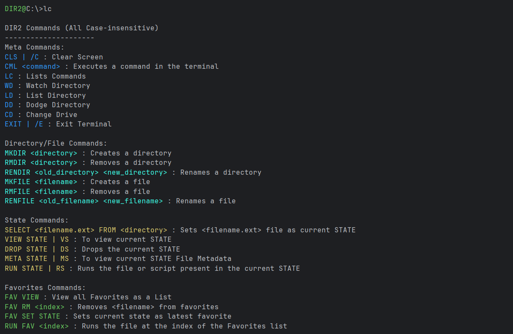
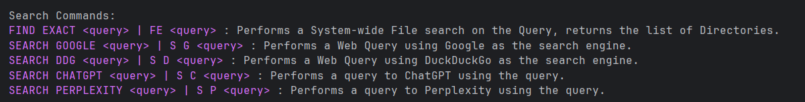

## dir2 — An SQL-Inspired Complete Shell

A Rust-based complete shell that reimagines file interaction and system operations through SQL-like commands and a Single-file state system. Navigate, select, and execute files and commands using familiar database query syntax alongside native shell capabilities.



## Latest Version

**Version 2.0.0** - Complete TUI Overhaul & SQL Parsing Foundation

## [Documentation Website](https://itcodehery.github.io/Project_Directory_2/)

Thank you to [Somnath Chaudhary](https://github.com/som-28) for creating the documentation website.

---

**Key Features:**

- **SQL-style file selection**: `SELECT "script.py" FROM ~/projects/` to load files into state
- **Stateful file management**: Single-file state system for focused workflow
- **Quick favorites system**: Save frequently used files and executables for instant access
- **Direct execution**: Run selected files or favorites with simple commands

**New Features in v2.0.0!**
- **Complete TUI Overhaul:** Fully interactive Terminal User Interface powered by `ratatui` and `crossterm`.
- **SQL Parsing Foundation:** Integrated `sqlparser` for primary parsing, enabling SQL query syntax with a seamless fallback to native shell commands.
- **Rich File Tables:** Native `ls`, `la`, `ll` executions are rendered as gorgeous, rich tables via `comfy-table`.
- **Improved UI/UX:** Persistent UI layout with dynamically centered input, powerline styled PWD banner, vertical scrollbar with mouse wheel support, and visual line dividers.
- **Config & History:** New `CONFIG` (`RC`) command to open your configuration, and a `HISTORY` (`HIST`) command for log management.

Transform your command-line experience from traditional navigation to intuitive querying. Perfect for developers who think in SQL and want a more declarative approach to complete shell operations.

## Building the Project

**Prerequisites:**

- Rust toolchain installed (visit [rustup.rs](https://rustup.rs/) for installation)
- Git (for cloning the repository)

**Build Steps:**

1. **Clone the repository:**

```bash
git clone <repository-url>
cd directory_2
```

Build the project:

```bash
cargo build --release
```

Run the application:

```bash
cargo run --release
```

Install globally (optional):

```bash
cargo install --path .
```

This installs dir2 to your Cargo bin directory, making it available system-wide.

**Development Build**: For development and testing, you can use the debug build which compiles faster:

```bash
cargo build
cargo run
```

**Dependencies**: All required dependencies will be automatically downloaded and compiled by Cargo during the build process.

**Example Usage:**



**List of Commands Implemented (v2.0.0):**




_Meta Commands:_

- **CLS | /C | CLEAR :** Clear Screen
- **ECHO <text> :** Prints text to the terminal
- **DOCS <cmd> :** Shows the comprehensive manual for a command
- **CONFIG | RC :** Instantly open ~/.dir2rc in the default $EDITOR
- **HISTORY | HIST :** View or restore command history
- **ls | la | ll :** List files as rich tables (replaces native ls executions)
- **LC :** Lists Commands
- **WD :** Watch Directory
- **LD :** List Directory
- **DD :** Dodge Directory
- **CD :** Change Drive
- **EXIT | /E :** Exit Shell

_Environment Commands:_

- **EXPORT <VAR>=<value> :** Sets an environment variable
- **UNSET <VAR> :** Removes an environment variable
- **ENV :** Lists all environment variables

_Alias Commands:_

- **ALIAS <name>='<cmd>' :** Sets a command alias
- **UNALIAS <name> :** Removes an alias
- **ALIASES :** Lists all aliases

_TUI Configuration:_

- **TUIADD <command> :** Adds a command to the interactive whitelist
- **TUIRM <command> :** Removes a command from the whitelist
- **TUILS :** Lists all interactive whitelist commands

_Directory/File Commands:_
- **MKDIR <directory> :** Creates a directory 
- **RMDIR <directory> :** Removes a directory 
- **RENDIR <old_directory> <new_directory> :** Renames a directory 
- **MKFILE <filename> :** Creates a file 
- **RMFILE <filename> :** Removes a file 
- **RENFILE <old_filename> <new_filename> :** Renames a file

_State Commands:_

- **SELECT filename.ext FROM directory :** Sets <filename.ext> file as current STATE
- **VIEW STATE | VS :** To view current STATE
- **DROP STATE | DS :** Drops the current STATE
- **META STATE | MS :** To view current STATE File Metadata
- **RUN STATE | RS :** Runs the file or script present in the current STATE

_Favorites Commands:_

- **FAV VIEW :** View all Favorites as a List
- **FAV RM <index> :** Removes <filename> from favorites
- **FAV SET STATE :** Sets current state as latest favorite
- **RUN FAV <index> :** Runs the file at the index of the Favorites list

Search Commands:

- **SEARCH GOOGLE <query> | S G <query> :** Performs a Web Query using Google as the search engine.
- **SEARCH DDG <query> | S D <query> :** Performs a Web Query using DuckDuckGo as the search engine.
- **SEARCH CHATGPT <query> | S C <query> :** Performs a query to ChatGPT using the query.
- **SEARCH PERPLEXITY <query> | S P <query> :** Performs a query to Perplexity using the query.
- **SEARCH CLAUDE <query> | S CL <query> :** Performs a query to Claude using the query.
- **SEARCH GEMINI <query> | S GM <query> :** Performs a query to Gemini using the query.

---


