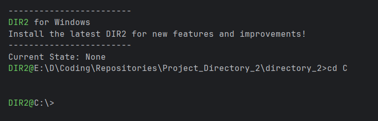

## dir2 (Directory 2.0) — An SQL-Inspired File System Interface for Windows

A Rust-based file system / terminal that reimagines file interaction through SQL-like commands and a Single-file state system. Navigate, select, and execute files using familiar database query syntax.



## [Documentation Website](https://itcodehery.github.io/Project_Directory_2/)

Thank you to [Somnath Chaudhary](https://itcodehery.github.io/Project_Directory_2/) for creating the documentation website.

---

**Key Features:**

- **SQL-style file selection**: `SELECT "script.py" FROM ~/projects/` to load files into state
- **Stateful file management**: Single-file state system for focused workflow
- **Quick favorites system**: Save frequently used files and executables for instant access
- **Global file search**: Find exact file locations system-wide with `FINDEXACT`
- **Direct execution**: Run selected files or favorites with simple commands

Transform your command-line file management from traditional navigation to intuitive querying. Perfect for developers who think in SQL and want a more declarative approach to file system operations.

Uses the `rust_search` module for system-wide search integration for Windows.

## Building the Project

**Prerequisites:**

- Rust toolchain installed (visit [rustup.rs](https://rustup.rs/) for installation)
- Windows 10/11 operating system
- Git (for cloning the repository)

**Build Steps:**

1. **Clone the repository:**

```bash
git clone <repository-url>
cd directory_2
```

Build the project:

```bash
cargo build --release
```

Run the application:

```bash
cargo run --release
```

Install globally (optional):

```bash
cargo install --path .
```

This installs dir2 to your Cargo bin directory, making it available system-wide.

**Development Build**: For development and testing, you can use the debug build which compiles faster:

```bash
cargo build
cargo run
```

**Dependencies**: All required dependencies, including the rust_search module, will be automatically downloaded and compiled by Cargo during the build process.

**Example Usage:**


**List of Commands Implemented (Pre-Release):**


_Meta Commands:_

- **CLS | /C :** Clear Screen
- **LC :** Lists Commands
- **WD :** Watch Directory
- **LD :** List Directory
- **DD :** Dodge Directory
- **CD :** Change Drive
- **EXIT | /E :** Exit Terminal

_State Commands:_

- **SELECT filename.ext FROM directory :** Sets <filename.ext> file as current STATE
- **VIEW STATE | VS :** To view current STATE
- **DROP STATE | DS :** Drops the current STATE
- **META STATE | MS :** To view current STATE File Metadata
- **RUN STATE | RS :** Runs the file or script present in the current STATE

_Favorites Commands:_

- **FAV VIEW :** View all Favorites as a List
- **FAV RM <index> :** Removes <filename> from favorites
- **FAV SET STATE :** Sets current state as latest favorite
- **RUN FAV <index> :** Runs the file at the index of the Favorites list

Search Commands:

- **FIND EXACT <query> | FE <query> :** Performs a System-wide File search on the Query, returns the list of Directories.
- **SEARCH GOOGLE <query> | S G <query> :** Performs a Web Query using Google as the search engine.
- **SEARCH DDG <query> | S D <query> :** Performs a Web Query using DuckDuckGo as the search engine.
- **SEARCH CHATGPT <query> | S C <query> :** Performs a query to ChatGPT using the query.
- **SEARCH PERPLEXITY <query> | S P <query> :** Performs a query to Perplexity using the query

---


