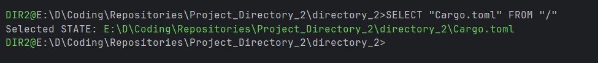

## dir2 (Directory 2.0) — An SQL-Inspired File System Interface for Windows

A Rust-based file system / 

terminal that reimagines file interaction through SQL-like commands. Navigate, select, and execute files using familiar database query syntax.

**Key Features:**

- **SQL-style file selection**: `SELECT "script.py" FROM ~/projects/` to load files into state
- **Stateful file management**: Single-file state system for focused workflow
- **Quick favorites system**: Save frequently used files and executables for instant access
- **Global file search**: Find exact file locations system-wide with `FINDEXACT`
- **Direct execution**: Run selected files or favorites with simple commands

Transform your command-line file management from traditional navigation to intuitive querying. Perfect for developers who think in SQL and want a more declarative approach to file system operations.

**Example Usage:**

**List of Commands Implemented (v0.1 Pre-Alpha):**

---

